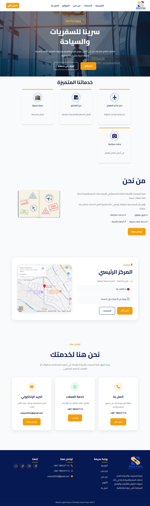

<div align="center">

# ✈️ Srayna Travel Website

### Modern & Responsive Travel Agency Website

A modern corporate website developed for **Srayna Travel & Tourism** using HTML5 and CSS3.


</div>

---

# 📖 About The Project

**Srayna Travel Website** is a modern and fully responsive corporate website designed for **Srayna Travel & Tourism**.

The website provides visitors with a clear overview of the company's travel services, introduces the business, displays the office location through Google Maps, and offers multiple communication channels including phone calls, WhatsApp, email, and social media.

The project focuses on delivering a clean user interface, responsive layouts, and a professional user experience across all screen sizes.

---

# 🌟 Key Features

- Modern & Professional UI
- Fully Responsive Layout
- Smooth Scrolling Navigation
- Travel Services Section
- Company Introduction
- Office Location (Google Maps)
- Click-to-Call Support
- WhatsApp Integration
- Email Contact
- Social Media Links
- Professional Footer
- Mobile Friendly Design

---

# 🛠 Built With

| Technology | Description |
|------------|-------------|
| HTML5 | Website Structure |
| CSS3 | Styling & Layout |
| CSS Grid | Responsive Cards |
| Flexbox | Flexible Layout |
| Google Fonts | Arabic Typography |
| Font Awesome | Icons |
| Google Maps Embed | Office Location |

---

# 📱 Responsive Design

Optimized for:

- 💻 Desktop
- 🖥 Laptop
- 📱 Mobile
- 📲 Tablet

---

# 📂 Website Sections

- 🏠 Home
- 💼 Services
- 👨‍💼 About Us
- 📍 Office Location
- 📞 Contact
- 🔗 Footer

---

# 📸 Website Preview

<p align="center">
  
</p>

---
# 🌐 Live Demo

🔗 **Website Link**
 https://mohammed123-collage.github.io/Srayna-Travel-Website/

---
# 🚀 Getting Started

Clone the repository

```bash
git clone https://github.com/Mohammed123-collage/Srayna-Travel-Website.git
```

Open the project

```text
index.html
```

No installation or dependencies are required.

---

# 📁 Project Structure

```text
Srayna-Travel-Website
│
├── index.html
├── styles.css
├── screenshots
│     └── preview.png
├── images
│     ├── hero.jpg
│     ├── logo.png
│     └── ...
└── README.md
```

---

# 🎯 Future Improvements

- Booking Request Form
- JavaScript Animations
- Dark Mode
- Multi-language Support (Arabic / English)
- Online Booking System
- Customer Testimonials
- FAQ Section

---

# 👨‍💻 Developer

**Mohammed S Al-Naham**

Front-End Web Developer

GitHub

https://github.com/Mohammed123-collage

---

# 📄 License

This project is published for **portfolio and educational purposes only**.

© 2025 Mohammed S Al-Naham. All rights reserved.

---

<div align="center">

### ⭐ If you like this project, don't forget to give it a Star.

</div>
